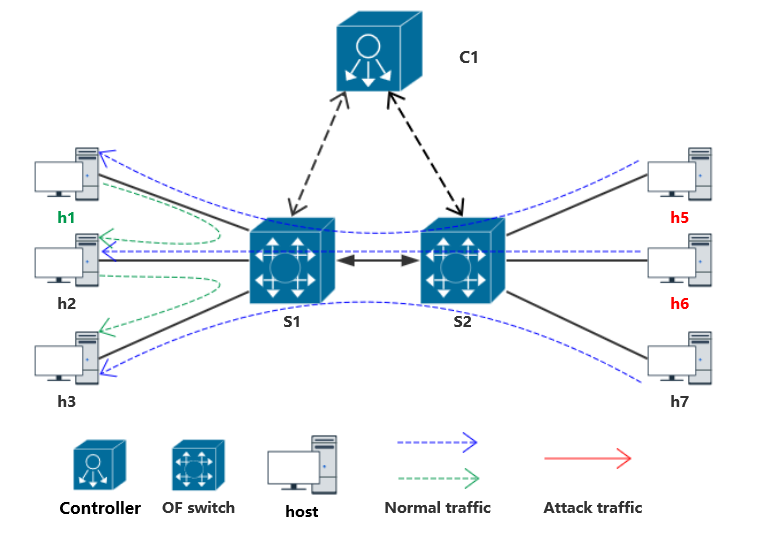
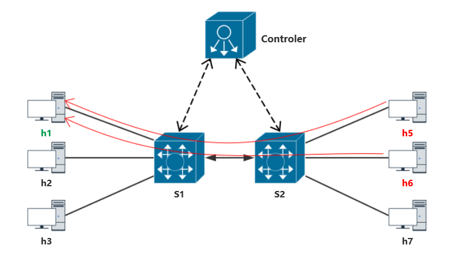
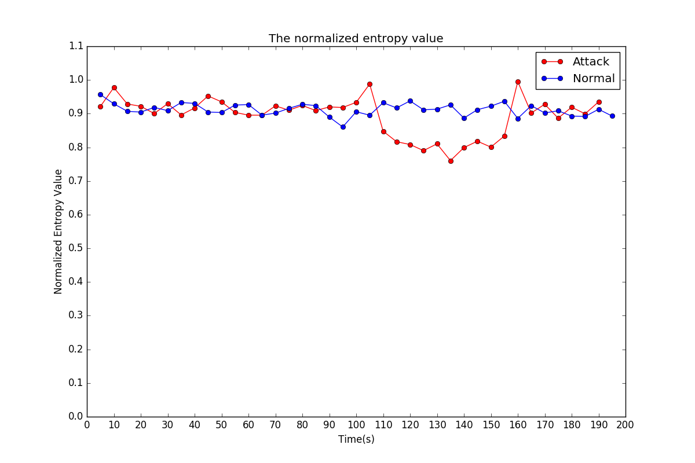

# DFAD
See more details in [link](http://dl.acm.org/citation.cfm?id=2848539)  
This project implemented this algorithm and tested it in a virtual network.  

## Environment
Ubuntu16.04LTS

## Dependence
* Open vSwitch  
* Ryu
* D-ITG
* Scapy
* matplotlib

## Download and Build

```Bash
wget https://github.com/MrDuGitHub/DFAD/archive/v0.2.tar.gz
tar -xzf v0.2.tar.gz
cd DFAD-0.2
make
```
## Construction of virtual network
### Network topology  




### Open vSwitch  
We use the OVS 2.9.0 version,and if you've installed and started it properly, you can build the required virtual network with the following command.

#### Create OF switch
```Bash
sudo ovs-vsctl add-br s1
sudo ovs-vsctl set-controller s1 tcp:127.0.0.1:6633
```

#### Add port
```Bash
sudo ovs-vsctl add-port s1 p1
sudo ovs-vsctl set Interface p1 ofport_request=10
sudo ovs-vsctl set Interface p1 type=internal
ethtool -i p1 
```
#### Connect the switch
```Bash
sudo ovs-vsctl set interface p4 type=patch
sudo ovs-vsctl set interface p4 options:peer=p8
```
### Virtual host  
We use the namespace feature of Linux to create a virtual host.
```Bash
sudo ip netns add h1 
sudo ip link set p1 netns h1
sudo ip netns exec h1 ip addr add 192.168.10.11/24 dev p1
sudo ip netns exec h1 ifconfig p1 promisc up 
``` 
### Controller  
We used Ryu as the SDN controller and created a simple two-layer switch app.
```Bash
cd ryu/ryu/app
ryu-manager --verbose simple_switch_13.py 
``` 
## Experiment  
### D-ITG  
D-ITG is used to generate the legitimate traffic.80% of the legitimate
traffic is TCP traffic and 20% is UDP traffic.
```Bash
cd D-ITG-2.8.1-r1023/src
```
```Bash
sudo ip netns exec h5 sudo ITGSend -T TCP -a 192.168.10.11 -o 512 -O 10 -t 200000 -l
``` 
```Bash
sudo ip netns exec h1 sudo ITGSend -T UDP -a 192.168.10.12 -o 96 -O 20 -t 200000 -l 
``` 
```Bash
sudo ip netns exec h1 sudo ITGRecv
``` 
### Scapy  
We use the Python tool Scapy to generate DDoS flooding attack traffic from zombie hosts to the victim.
```Bash
cd DFAD-0.2/utils
sudo ip netns exec h5 python synFlood.py 192.168.10.11 10
``` 
### Entropy
Start detector.  
Description of parameters:  
* -m M W 
* -l lambda 
* -t interval 
* -i initial_n
* -s Switch
* -c Controller
```Bash
sudo ./entropy -m 2 3 -l 3 -t 5 -i 10 -s
``` 
### matplotlib
```Bash
cd DFAD-0.2/utils
python Collector.py
python Draw.py
``` 
> See more details in [order](utils/order)  
## Result  

